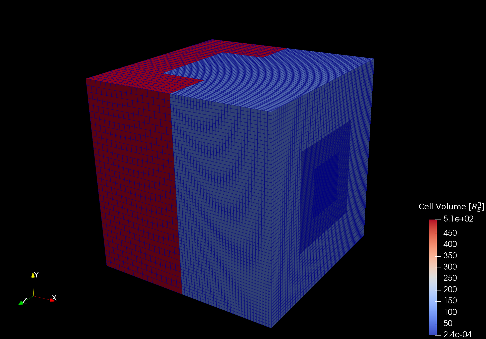

# Overview

`swmfio` reads magnetosphere and ionosphere data files from an [SWMF](https://clasp.engin.umich.edu/research/theory-computational-methods/swmf-downloadable-software/) run.
For the (BATSRUS) magnetosphere module, it reads `.out`, `.tree`, and `.info` files.
For the (RIM) ionosphere module, it reads `.tec` files (for RIM `.idl` files, use [SpacePy](https://spacepy.github.io/autosummary/spacepy.pybats.rim.html)). Although [SpacePy](https://spacepy.org) contains a BATRSUS native file reader, it returns an unstructured grid, which makes interpolation (needed for field line tracing) much slower.

`swmfio`  also reads CCMC `.cdf` files, which contains most of the information contained in the native BATSRUS magnetosphere files.

For BATSRUS files, `swmfio` returns a [Numba](https://numba.pydata.org/) class, with the simulation data in arrays as class attributes and interpolation and differentiation as class methods.

For RIM files, returns a tuple `(data_arr, varidx, units)`, where `data_arr` is a NumPy array with the data, `varidx` is a Numba typed dictionary which maps variable name strings to their corresponding index in `data_arr`, and `units` is a dictionary of units.

`swmfio` also provides a function to output the magnetosphere (BATSRUS) data on a native grid to a VTK file, as either an unstructured voxel or hexahedra grid.

This package has similar functionality to the Julia package [`Batsrus.jl`](https://github.com/henry2004y/Batsrus.jl)
with the exception that in `swmfio`
* there is an interpolator interface,
* [Kameleon/CCMC](https://ccmc.gsfc.nasa.gov/Kameleon/) `.cdf` files can be read, and
* the VTK output file has the cell-centered data at the center of cells [instead of at cell vertices](https://github.com/henry2004y/Batsrus.jl/issues/3).

For example data files, see [http://mag.gmu.edu/git-data/swmfio/](http://mag.gmu.edu/git-data/swmfio/).

This code is used in [https://github.com/GaryQ-physics/magnetopost](https://github.com/GaryQ-physics/magnetopost) to post-process magnetosphere simulation data.

This code was developed with the help of the code of [Batsrus.jl](https://github.com/henry2004y/Batsrus.jl) and the [SWMF](https://clasp.engin.umich.edu/research/theory-computational-methods/swmf-downloadable-software/) Fortran code.

# Install

Requires Python 3.

## User

```
pip install 'git+https://github.com/GaryQ-physics/swmf_file_reader.git' --upgrade
```

## Developer

```
git clone https://github.com/GaryQ-physics/swmf_file_reader.git
cd swmf_file_reader
pip install --editable .
```

# Examples

* BATSRUS `.out`: [demo_batsrus_native.py](https://github.com/GaryQ-physics/swmf_file_reader/blob/main/demo_native.py)
* BATSRUS `.cdf`: [demo_batsrus_cdf.py](https://github.com/GaryQ-physics/swmf_file_reader/blob/main/demo_cdf.py)


* RIM `.tec`: [demo_rim_tec.py](https://github.com/GaryQ-physics/swmf_file_reader/blob/main/demo_rim_tec.py) 
* RIM `.cdf`: [demo_rim_cdf.py](https://github.com/GaryQ-physics/swmf_file_reader/blob/main/demo_rim_cdf.py)

    For RIM `.idl` files, use [SpacePy](https://spacepy.github.io/autosummary/spacepy.pybats.rim.html).


* BATSRUS to VTK file: [demo_vtk.py](https://github.com/GaryQ-physics/swmf_file_reader/blob/main/demo_vtk.py); The image at the start of this README was created using ParaView with the [output file from the execution of this demo](http://mag.gmu.edu/git-data/swmfio/3d__var_2_e20190902-041000-000.vtk).


# Motivation

This code was developed in support of the paper [Blake et al., 2021, Recreating the Horizontal Magnetic Field at Colaba During the Carrington Event With Geospace Simulations](https://doi.org/10.1029/2020SW002585).

Although [SpacePy](https://spacepy.org) contains a BATRSUS native file reader, it returns an unstructured grid, which makes interpolation (needed for field line tracing) very slow. [Batsrus.jl](https://github.com/henry2004y/Batsrus.jl) can read native BATSRUS files and generate VTK files, but the mapping to the [native grid was not quite correct](https://github.com/henry2004y/Batsrus.jl/issues/3). [Kameleon](https://ccmc.gsfc.nasa.gov/Kameleon/) can read native BATSRUS files and interpolate them on the native grid. However, this software is no longer being developed and is not easy to compile; in addition, [extra C wrappers can compilation are needed](https://github.com/rweigel/kameleon) to interface with Python. Finally, [Kamoto](https://github.com/nasa/Kamodo) can read BATSRUS files, but file reading and interpolation was [too slow for our application](https://github.com/nasa/Kamodo/issues/21).

# Acknowledgments

This work was in part supported by NASA Grant 80NSSC20K0589 "Physics-based modeling of the magnetosphere-ionosphere system under Carrington-scale solar driving: response modes, missing physics and uncertainty estimates", PI: Antti Pulkkinen and the subaward "Ground Magnetic Field Perturbations under Extreme Space Weather Conditions", PI: R.S. Weigel.

Hongyang Zhou, the developer of [Batsrus.jl](https://github.com/henry2004y/Batsrus.jl).

# Notes

BATSRUS output consists of files: `3d_*.out`, `3d_*.tree`, `3d_*.info`. From the SWMF documentation,

`3d_*.out:`
> ... consists of a sequence of 1d arrays of the same length and corresponding variable names, together with a few extra parameters. Those variable names include x, y, and z coordinates. Each entry of the arrays corresponds to a unique gridpoint (and has a unique (x,y,z) value).

`3d_*.tree:`
> Consists of a 2d arrays describing the block tree, and a few extra parameters. The 2d array is referred to internally as "iTree_IA" (following the BATRUS source code name). The 2d array describes a tree, and the nodes of the tree are indexed by "iNode". Not all the nodes are used to get the gridpoints, only the leaves of the tree are. Restricting to just the leaves  yield "iNodes" that are not a simple range (1,2,3,...), so they can alternatively be indexed by a different "iBlock". Each leaf corresponds to a nI-by-nJ-by-nK regular grid of gridpoints, where "nI","nJ",and "nK" are fixed and determined from the other files.

`3d_*.info:`
> ... a text file containing nI,nJ,nK, and other meta data.

RIM output consists of files: `i_*.tec`:
> A text file, consisting of the header with variable information, and then the data in ASCII format. The data consists of the value of the variables given on a 2d regular grid in latitude longitude. The radius is fixed.
